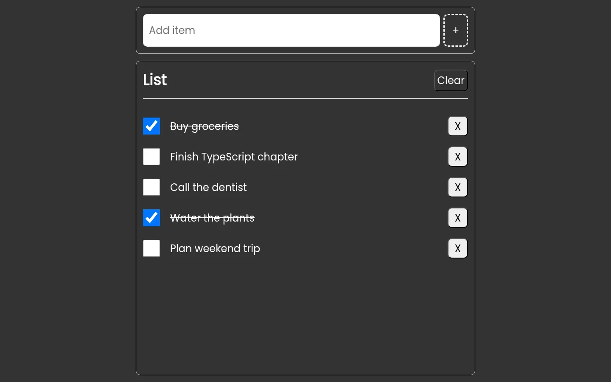
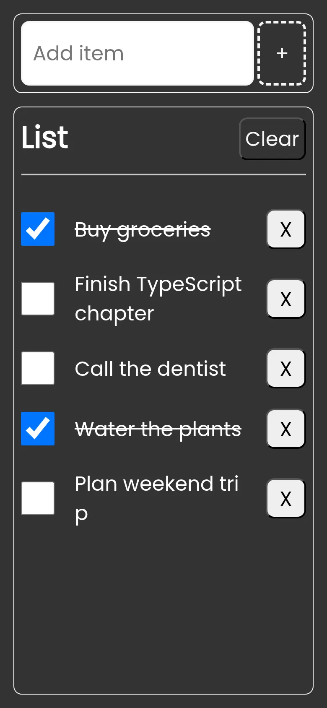

# TS Todo

[English](README.md) | **Русский**

Список задач на чистом TypeScript и Vite: классы, интерфейсы и синглтоны вместо UI-фреймворка, задачи хранятся в `localStorage`.

> 🎓 **Учебный проект** · сентябрь 2025. Список задач, написанный при изучении классов и интерфейсов TypeScript; бэкенда нет, все данные живут в браузере.

**Демо:** https://barbarafromtonshaevo.github.io/ts-todo/

<p>
  
  
</p>

## Возможности

- Добавление задачи через форму (до 40 символов, пустой ввод игнорируется).
- Отметка задачи выполненной: текст зачёркивается.
- Удаление одной задачи или очистка всего списка.
- Список сохраняется между перезагрузками страницы.

## Стек

| Область | Инструменты |
| --- | --- |
| Язык | TypeScript 5 (`strict`), нативные DOM API |
| Сборка | Vite 7 |
| Стили | Обычный CSS |
| Хостинг | GitHub Pages (пакет `gh-pages`) |

## Архитектура

```
форма / кнопки ──► main.ts ──► FullList (состояние + localStorage) ──► ListTemplate ──► <ul id="listItems">
```

1. [src/main.ts](src/main.ts) вешает обработчики на форму и кнопку Clear, на `DOMContentLoaded` загружает сохранённый список и отрисовывает его.
2. [src/model/FullList.ts](src/model/FullList.ts) хранит массив задач и после каждого изменения записывает его в `localStorage` (ключ `myList`).
3. [src/model/ListItem.ts](src/model/ListItem.ts) — одна задача с приватными полями за геттерами и сеттерами.
4. [src/templates/ListTemplate.ts](src/templates/ListTemplate.ts) пересобирает `<ul>` из списка и навешивает на каждую строку обработчики чекбокса и удаления.

### Ключевые решения

- **Синглтоны для модели и представления.** У `FullList.instance` и `ListTemplate.instance` приватные конструкторы, поэтому во всём приложении одно состояние и один рендерер.
- **Каждый класс реализует интерфейс** (`List`, `Item`, `DOMList`): контракт описан отдельно от реализации.

## Структура проекта

```
src/
├── css/style.css            # стили приложения
├── model/
│   ├── FullList.ts          # состояние списка + сохранение в localStorage (синглтон)
│   └── ListItem.ts          # одна задача
├── templates/
│   └── ListTemplate.ts      # отрисовка списка в DOM (синглтон)
└── main.ts                  # точка входа, обработчики событий
```

## Запуск

Нужен Node.js 20.19+ (Vite 7).

```bash
npm install
npm run dev          # http://localhost:5173/ts-todo/
```

Другие скрипты:

```bash
npm run build        # проверка типов через tsc и сборка в dist/
npm run preview      # локальный просмотр продакшен-сборки
npm run deploy       # сборка и публикация dist/ в ветку gh-pages
```

## Деплой

Задеплоено на GitHub Pages из ветки `gh-pages`. CI нет: `npm run deploy` собирает проект локально и публикует `dist/` пакетом `gh-pages`. `base` в Vite задан как `/ts-todo` в [vite.config.js](vite.config.js).

## Известные ограничения

- Длинные слова в задаче переносятся по любой букве (`word-break: break-all`), на мобильном это заметно.
- Сохранённые данные повторяют имена приватных полей (`_id`, `_item`, `_checked`), поэтому переименование поля в `ListItem` ломает списки, уже лежащие в `localStorage`.
- Clear удаляет всё без подтверждения, редактировать задачи нельзя.

## Что бы я улучшила

- **Явная сериализация.** Пара `toJSON()` / `fromJSON()` в `ListItem` отвязала бы формат хранения от внутреннего устройства класса.
- **Мягкий перенос текста.** `overflow-wrap: anywhere` разбивает только слова, которые не помещаются.
- **Юнит-тесты** на Vitest для `FullList`: добавление, удаление, очистка и загрузка из `localStorage`.
- **Деплой через GitHub Actions** вместо публикации с локальной машины.
